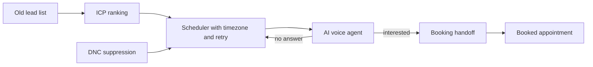

# Database Reactivation

> AI voice that calls a business's dead leads and turns them back into booked work.

Database Reactivation re engages old, cold leads for local businesses. An AI voice agent handles the outreach, the conversation, and the booking handoff, fully automated and on a schedule. It runs on a pay per booked model.

> This repository is an architecture overview. The production code, prompts, and customer data are private.

## How it works

## Stack

**Voice and AI** &nbsp; VAPI, LLMs
**Backend** &nbsp; Python
**Data** &nbsp; SQLite, Google Sheets
**Cloud** &nbsp; AWS EC2, systemd timers
**Email** &nbsp; Resend

## Engineering highlights

- Timezone aware dialing windows with a retry and backoff cadence, plus DNC suppression for compliance.
- ICP ranking so high value, reactivatable trades get dialed first instead of burning the list at random.
- Owner contact capture and a one lead pilot flow, built around a land and expand offer.
- Runs unattended on EC2 through systemd timers, with health checks on every cycle.

## Status

Live automation, running on a schedule.

---

Part of the work of [Denis Redzic](https://denis.denisai.online).
